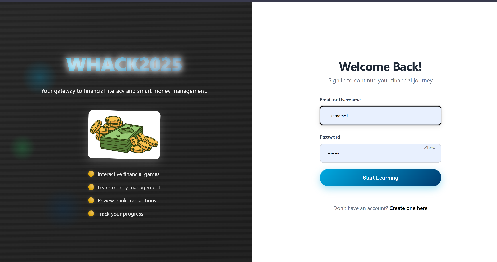
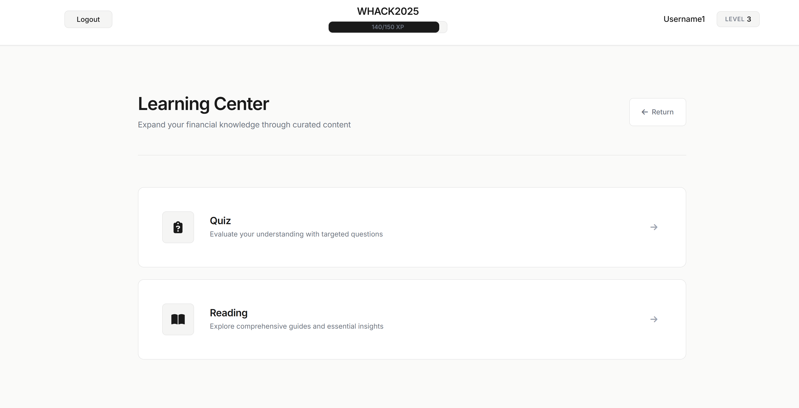
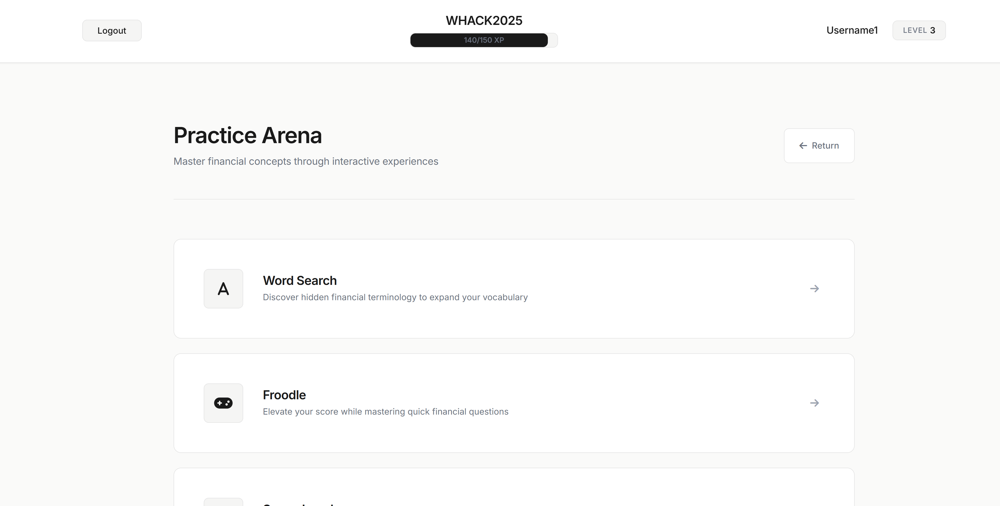
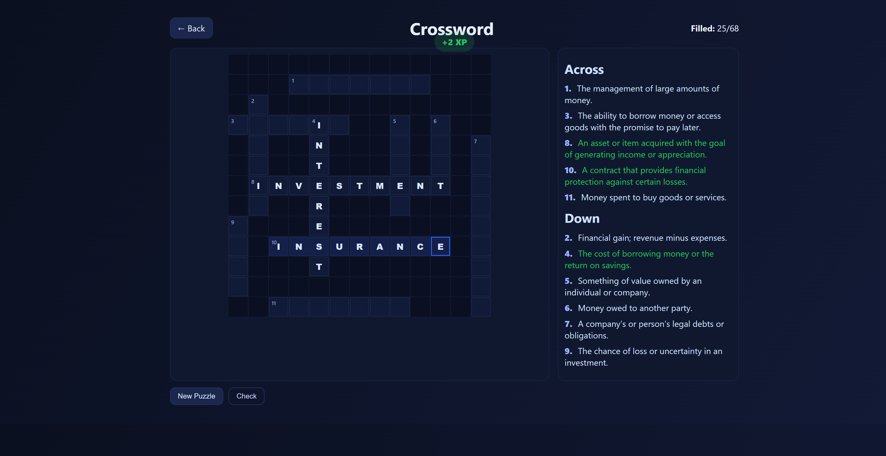
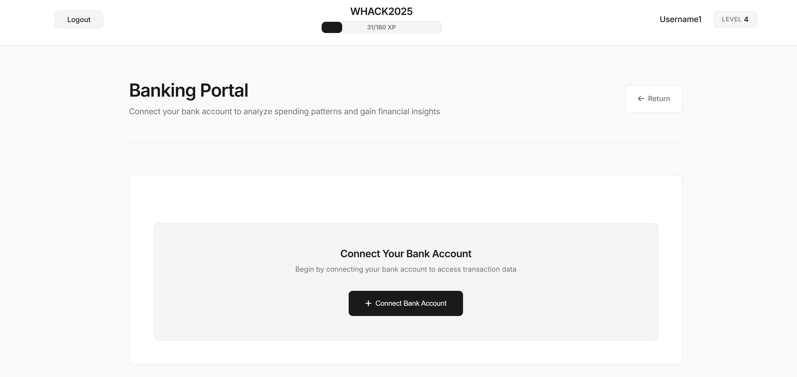

# WHACK2025 Submission

**WHACK2025** is a full-stack Flask web application that gamifies financial education through interactive activities, learning zones, and real banking integration. Users can register, earn XP, level up, and explore a digital environment while connecting their real (or sandbox) bank accounts securely via Plaid. AI integration through Gemini and Ollama provides intelligent financial analysis and personalized insights.

---

## 🚀 Features

* **User Accounts & Progression**
  Secure registration, login, and XP-based leveling system.

* **Interactive Learning & Game Zones**
  Explore areas like quizzes, games, and reading materials to earn XP and improve financial literacy.

* **Plaid Banking Integration**
  Connect sandbox or real bank accounts to view transactions and analyze spending.

* **AI-Powered Financial Insights**

  * **Gemini API**: Analyzes transaction data for personalized insights.
  * **Ollama Local Model**: Acts as a financial advisor chatbot.

* **Clean, Responsive Interface**
  Built with Flask templates and CSS for a smooth user experience.

---

## 🧩 Project Structure

```
WHACK2025/
├── app.py                   # Flask backend & routes
├── requirements.txt         # Dependencies
├── .env                     # Environment variables (Plaid, Gemini, etc.)
├── README.md
├── .gitignore
│
├── database/                # Auto-created SQLite database folder
│   └── WHACK2025.db
│
├── templates/               # HTML templates
│   ├── base.html
│   ├── login.html
│   ├── register.html
│   ├── learn_zone.html
│   ├── game_zone.html
│   ├── bank_zone.html
│   └── ...
│
├── static/                  # Front-end assets
│   ├── css/
│   ├── js/
│   ├── images/
│   └── pygbag/
│       └── main.py          # Interactive environment logic
│
└── Screenshots/             # Project screenshots for documentation
    ├── analyzebankspendings.png
    ├── crossword.png
    ├── gamezone.png
    ├── learningzone.png
    └── login.png
```

---

## ⚙️ Setup & Installation

### 1️⃣ Clone the Repository

```bash
git clone https://github.com/yourusername/whack2025.git
cd whack2025
```

### 2️⃣ Create a Virtual Environment

```bash
python -m venv venv
source venv/bin/activate       # macOS/Linux
venv\Scripts\activate          # Windows
```

### 3️⃣ Install Dependencies

```bash
pip install -r requirements.txt
```

### 4️⃣ Create a `.env` File

Create a `.env` file in the project root with the following content:

```bash
SECRET_KEY=your-secret-key
PLAID_CLIENT_ID=your-plaid-client-id
PLAID_SECRET=your-plaid-secret
PLAID_ENV=sandbox
GEMINI_API_KEY=your-gemini-api-key
OLLAMA_BASE_URL=http://localhost:11434
```

### 5️⃣ Initialize the Database

```bash
python app.py
```

(Your database will be automatically created under the `database/` folder.)

### 6️⃣ Run the Application

```bash
python app.py
```

Then visit:
👉 [http://localhost:5000](http://localhost:5000)

---

## 📸 Screenshots

### Login Page



### Learning Zone



### Game Zone



### Crossword Game



### AI Analysis of Bank Spendings



---

## 🧠 Technologies Used

* **Flask** (Python web framework)
* **Flask-SQLAlchemy** (ORM for SQLite database)
* **Plaid API** (Bank account integration)
* **Google Gemini API** (AI analysis)
* **Ollama Local Model** (AI financial advisor)
* **Pygame & Pygbag** (Interactive environment)
* **HTML, CSS, JS** (Frontend)

---

## 🔐 Environment Variables Explained

| Variable          | Description                                                   |
| ----------------- | ------------------------------------------------------------- |
| `SECRET_KEY`      | Flask session key for security                                |
| `PLAID_CLIENT_ID` | Your Plaid application client ID                              |
| `PLAID_SECRET`    | Your Plaid secret key                                         |
| `PLAID_ENV`       | Plaid environment (`sandbox`, `development`, or `production`) |
| `GEMINI_API_KEY`  | Google Gemini API key for AI features                         |
| `OLLAMA_BASE_URL` | Local Ollama endpoint (default: `http://localhost:11434`)     |

---

## 🧪 Testing & Debugging

Run Flask in debug mode (enabled by default):

```bash
python app.py
```

You can log in, register, and test XP progression, Plaid sandbox accounts, and Gemini AI features locally.

---

## 🏁 Submission Info

This project is the official **WHACK2025 Hackathon Submission** — combining gamified financial education, AI-powered advice, and real banking APIs into one interactive experience.

---

## 🧾 License

MIT License — feel free to use and modify for educational or personal projects.
